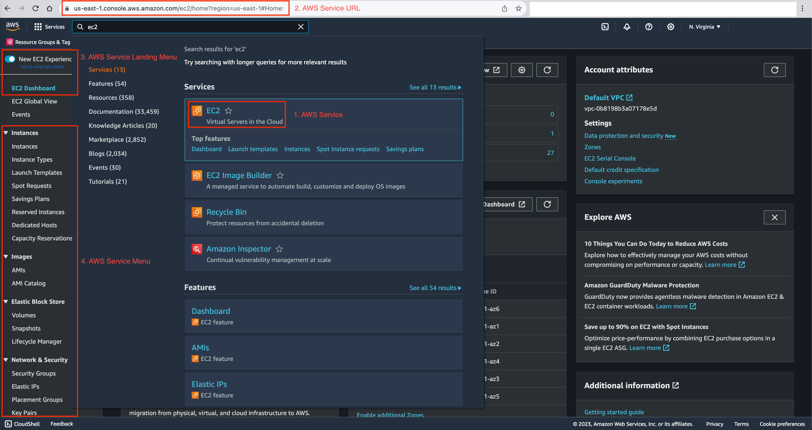
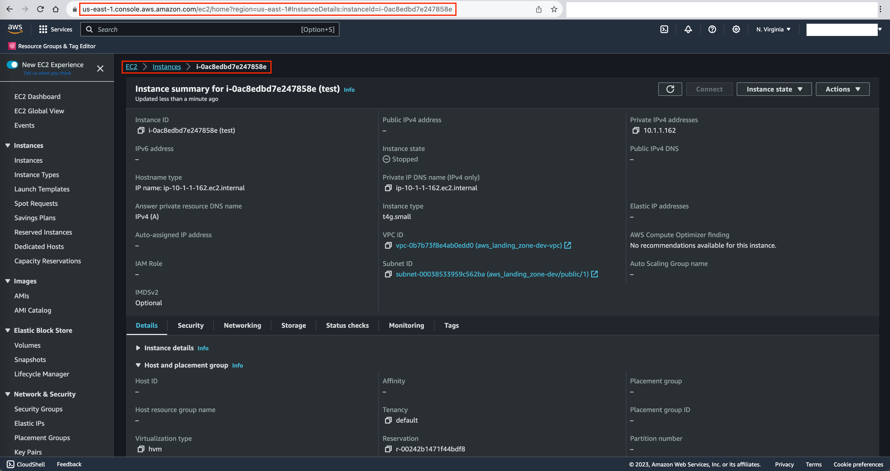
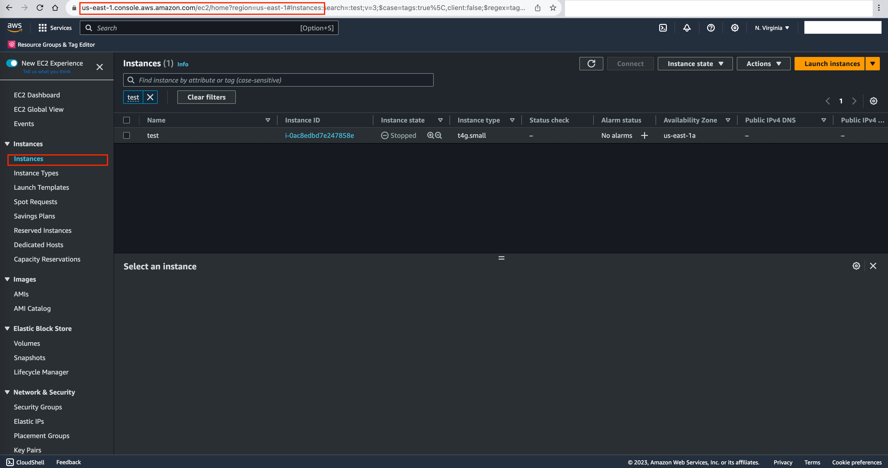

About AWS Console URL
==============================================================================
本文档来对 AWS Console URL 进行逆向工程, 研究其生成规律. 然后针对这一规律, 对其进行数据建模.

下图是一个 EC2 实例的 AWS Console URL, 用于打开 EC2 实例的控制台页面. 我们可以看到, 在搜索框输入 EC2 后, 点击 EC2 图标可以跳转到该页面. 在左边还有许多菜单, 用于查看 Instances, Launch Templates, AMIs, Volumes, Snapshots, Security Groups 等相关信息.

针对这一模式, 我们定义:

1. 在搜索框中搜索到的服务被称为 **AWS Service** (简称 Service).
2. Service 会有一个 **Landing Page URL**, 我们称为 Service Landing Page Url.
3. 所有的菜单我们叫做 **Menu**, 其中必有一个 Landing Page 的 Menu.
4. Service 下的所有 Menu 都会有一个 Url, 我们称为 **Service Menu Url**.

举例来说, EC2 Service Landing Page Url 是 ``https://us-east-1.console.aws.amazon.com/ec2/home?region=us-east-1#Home:``

- 这里的 ``console.aws.amazon.com`` 是 AWS Console 的 domain 域名.
- 而紧跟在域名之后的是 Service 的名字 ``ec2``. 之后才是具体的 URL path.
- 这其中 us-east-1 和 region=us-east-1 可以将你导航到不同的 region. 而如果你不指定它们的话, 则将会导航到你之前打开的页面所在的 region, 就像这样 ``https://console.aws.amazon.com/ec2/home?#Home:``.

我们再看看 Service Menu Url. 下图是 AWS EC2 Instances menu 的 URL.

除了 EC2 Instances, 我们还列出了其他几个 Service menu 的 URL 的例子.

- EC2 Instances: ``https://us-east-1.console.aws.amazon.com/ec2/home?region=us-east-1#Instances:v=3;$case=tags:true%5C,client:false;$regex=tags:false%5C,client:false``
- EC2 Images: ``https://us-east-1.console.aws.amazon.com/ec2/home?region=us-east-1#Images:visibility=owned-by-me;v=3;$case=tags:false%5C,client:false;$regex=tags:false%5C,client:false``
- EC2 Volumes: ``https://us-east-1.console.aws.amazon.com/ec2/home?region=us-east-1#Volumes:``
- EC2 Snapshots: ``https://us-east-1.console.aws.amazon.com/ec2/home?region=us-east-1#Snapshots:``

可以看出 EC2 下的所有 menu 都会以 ``https://${domain}/ec2/...`` 开头, 而用 ``#Instances``, ``#Images``, ``#Volumes``, ``#Snapshots`` 来区分不同的 menu.

而一般这些 menu 下面会有很多 AWS Resource, 你可以点进去查看每个 Resource 的详细信息, 这个页面我们称之为 AWS Resource page. 下图是一个具体的 AWS EC2 Instance 的例子. 它的 URL 是 ``https://us-east-1.console.aws.amazon.com/ec2/home?region=us-east-1#InstanceDetails:instanceId=i-0ac8edbd7e247858e``.

总结下来, 我们需要定义如下概念:

- Service Landing Page: 每个 Service 的主页面.
- Service Menu Page: 每个 Service 下的 Menu 页面.
- Resource Page: 每个 Resource 的页面.

- https://console.chime.aws.amazon.com/home/#/accountStart?_k=iy3i2e
- https://us-east-1.console.aws.amazon.com/ec2/home?region=us-east-1#Home:

- Examples:
    - EC2 Instance: ``https://us-east-1.console.aws.amazon.com/ec2/home?region=us-east-1#InstanceDetails:instanceId=i-0ac8edbd7e247858e``
- Format: ``https://${optional_region}${sub_domain}.${domain}/${service_id}/home?${param}#${path}``
    - ``optional_region``: 可选的 region, 如果不指定则默认为当前 region. 这个的值可能为 ``us-east-1.``. 这个值能构成一个完整的 DNS, 会决定你的请求会被路由到哪个 region 的服务器上处理.
    - ``sub_domain``: 二级子域名, 对于 AWS Commercial, 这个值为 ``console.aws``, 而对于 aws-us-gov cloud 和 aws-cn 来说这个值就是 ``console``.
    - ``domain``: 域名, 对于 AWS Commercial, 这个值为 ``amazon.com`` 而对于 aws-us-gov 或 aws-cn 来说则是 ``amazonaws-us-gov.com`` 或 ``amazonaws-cn.com``.
    - ``service_id``: Service 的 ID, 比如 ``ec2``, ``s3``, ``iam`` 等, 注意有些服务的 service id 由于 console 的界面的变化是有版本的, 例如 ``iamv2``.
    - ``param``: URL 中用 url encode 和 ``&`` 拼接起来的参数, 其中几乎所有的 service 都会有参数 ``region=us-east-1`` 可以用来指定 region. 这个参数中的 region 比 ``optional_region`` 的优先级更高, 它能真正决定你会跳转到哪个 region. 如果这个 region 和 ``optional_region`` 的值不一样, 那么它会被服务器重定向到 region 中所指定的服务器上处理. 还有一点要注意, param 部分最后都会有一个 ``#`` 用来表示 param 部分结束了, 以和后面的 ``path`` 分隔开.
    - ``path``: url 后面的 path.
        - 对于 service menu page, 这个 path 通常会包含一个 menu 的部分.
        - 对于 resource page:
            - 如果这个 service 只有一种 resource, 例如 SNS, SQS.
            - 如果这个 service 有很多种 resource, 例如 EC2, 这个 path 通常会包含一个 menu 部分以及一个 resource_id 部分, 两者会用 ``:`` 或者 ``/`` 分隔开.

{
    "service_id": "ec2",
    "service_name": "Amazon Elastic Compute Cloud",
    "menus": [
        {
        }
    ],
    "resources": [
        {
            "url": {
            },
            "search": {
            ]
            }
        }
    ]
}